A deer population simulation using Netlogo. Agent-based modelling assignment for COM2014 Computational Intelligence, University of Exeter. 

The following can also be found in the INFO tab in "deer_simulation.nlogo":  

# 1. Model Design
## 1.1 Driving Question
What are the potential impacts of hunting as a population control measure on deer population dynamics and automobile accident rates involving deer, and how can these outcomes be simulated through an agent-based modelling approach?

## 1.2 Agents Properties
### Deer agents properties:
* Breed
* Age
* Gender 
* Pregnant/not pregnant (female deer only)
* Location
* Heading

### Hunter agents properties:
* Location 
* Heading
* Hunters' skill level 

### Car agents properties:
* Location
* Heading
* Speed
* Drivers' skill level 

## 1.3 Agents Behaviour
* Deer and hunters perform random walks.
* After reaching a certain age, deer agents will die.
* Male and female deer agents can mate, making the female deer pregnant. As long as the female deer survives, she will give birth to a new deer after a certain period of time  (gestation period, as determined by her breed).
* A hunter agent can harvest a deer agent, causing the deer to die.
* Cars move straight along the road they're on.
* A car agent can hit a deer agent, causing the deer to die.

## 1.4 Parameters
* Initial number of male and female deer
* Number of roads/length of roads
* Number of cars
* Number of hunters
* Start/end dates of hunting season
* Start/end dates of mating season
* Breed of deer
* Mating probability success rate
* Accident probabilty rate 
* Harvest probability rate

## 1.5 Measures
* Population of deer over time
* Deer harvested over time
* Number of car accidents involving deer over time

# 2. Model implementation

## WHAT IS IT?
This model simulates the effects of hunting on deer population and vehicle accident rates involving deer. The world, which forms the deer habitat, includes male deer in blue, female deer in pink, roads in gray bands and including cars, and, during hunting season, hunters in black. The world background color is displayed in light green in spring, dark green in summer, orange-brown in autumn, and white in winter.
 
## HOW IT WORKS
The deer population, all initially 2 years old, are randomly placed around the world and are set to wander randomly. During the mating season, if a female and male deer (aged at least 1 1/2 years old) occupy the same patch, then, based on a mating probability success rate, the female becomes pregnant. As time elapses, assuming the pregnant deer does not die, either by natural causes, hunters, or by accident with an automobile, the deer will give birth to either 1 or 2 randomly chosen offspring with randomly assigned gender.

During hunting season, hunters are randomly placed around the world and are set to wander randomly. If a hunter and a deer occupy the same patch, then, based on a harvesting probability rate, the hunters harvest the deer during a user-defined hunting season, thereby reducing the deer population.

The cars are randomly placed on the road(s) and are set to move horizontally along the road(s). If a car and a deer occupy the same patch, then, based on an accident probability rate, the car hits the deer, thereby reducing the deer population.

Because the cars move one patch per tick, time must be adjusted in the model by determining how many hours goes by for each tick in the simulation. Days in the model are determined by dividing the number of miles per patch of road by the average speed of the cars.

### Parameters
* SIZE-WORLD: Sets size of the world, where each whole unit represents 9000 square miles.
* NUM-ROAD: Sets the number of roads.
* NUM-CAR-PER-ROAD: Sets the number of cars for each road.
* AVERAGE-SPEED-CAR: Sets the average speed of the cars on the road.
* MILES-PER-ROAD: Sets the miles of road represented by each road. 
* ACCIDENT-PROBABILITY: Sets the probability that a car and a deer occupying same patch will be involved in an accident.
* NUM-FEMALE-DEER: Initializes the female deer population, where each unit represents 1000 deer.
* MATE-PROBABILITY: Sets the probability that a female deer and a male deer occupying same patch will successfully mate.
* BREED-DEER: Selects the deer breed (this sets, for example, the gestation period.
* NUM-HUNTER: Sets the hunter population, where each unit represents 1000 hunters.
* HARVEST-PROBABILITY: Sets the probability that a hunter will successfully harvest a deer occupying same patch.

## HOW TO USE IT
1. Adjust the input parameters (see above), or use the default settings (the default settings were calibrated to match actual numbers for the state of Pennsylvania for 2020-2021).
2. Press the SETUP button and a series of dialog boxes will appear, allowing the user to:
(1) enter an optional file name and location for saving the model output, 
(2) specify start and end dates of annual hunting season, and 
(3) specify the start and end dates of the annual mating season.
3. Press the GO button to start the simulation.

## THINGS TO NOTICE
* Watch the deer population grow or shrink on the monitor.
* See the seasons change.
* Notice the appearance of hunters during hunting season as well as the consequential decrease in deer population. 
* Witness car accidents involving deer.

## THINGS TO TRY
* Try altering the number of hunters and the duration of the hunting season, and notice its effect on the stability of deer population.
* Try altering the number of roads and cars, and notice its effect on the number of deer hits. 
* Turn on the reset-data-every-year? switch to reset the monitors every year.

## EXTENDING THE MODEL
* Add corn crop agents, which would, once eaten, give deer agents energy (if deer have too low energy level, then they would die) and could be used to assess the economical impacts deer have on crops (eating and/or damaging).
* Add a modify button that allows user to change parameters during the simulation.
* Add specific hunting seasons for female and male deer. 
* Add distribution functions, for example, to the gestation period or deer natural death rates, to more accurately model reality (e.g., deer aren't always pregnant for exactly x amount of days).
* Add variability in terrain (e.g., when a deer is going up a hill, its speed alters).

## NETLOGO Extensions
* The time extension was added to allow for calculating the number of days between the dates that the user inputs in.
* The csv extension was added to allow for important data from the simulation could be inserted in a csv file so that user can analyze the data using their program of choice. 

## RELATED MODELS
 * The wolf and sheep model in Netlogo's model library to the extent that both models model predators (hunters/wolves) and prey (deer/sheep).
 * "Estimating the effects of changes in harvest management on white-tailed deer (ODOCOILEOUS VIRGINIANUS) populations", Master's thesis by Van Burskirk, A. [1]: The author built a netlogo model to provide a tool for the assessment of deer density reduction programs. In particular, the author investigates “the effects of different deer densities, harvest rates of antlerless deer (female adults, female juveniles, and fawns), and sizes and shapes of deer removal areas on the ability to locally reduce deer densities.”

# 3. Execution and Analysis of Model
In order to explore the model, it is important to run multiple runs with the same parameter values to measure the randomness. In addition, it is important to also alter the parameter values to see how it affects the model. In this section, altering the number of hunters and their harvest probability rate was explored for five runs for each change in parameter value (see python jupyter notebook for more detail).

The parameter for the number of hunters and harvest probability was altered 4 times: high number of hunters and high harvest probability, high number of hunters and low harvest probability, low number of hunters and high harvest probability, and low number of hunters and low harvest probability.
## High number of hunters & high harvest probability
The following are the initial parameters:

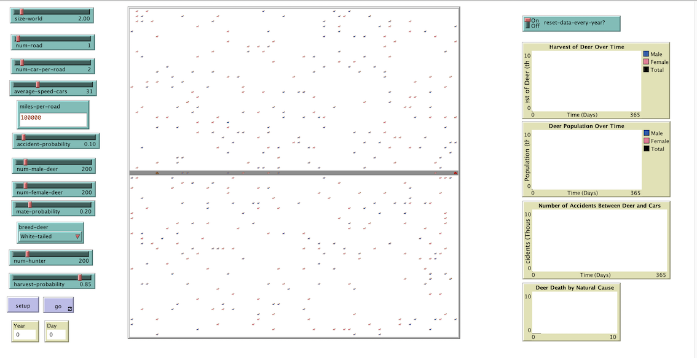

## High number of hunters & low harvest probability
The following are the initial parameters:

## Low number of hunters & high harvest probability
The following are the initial parameters:

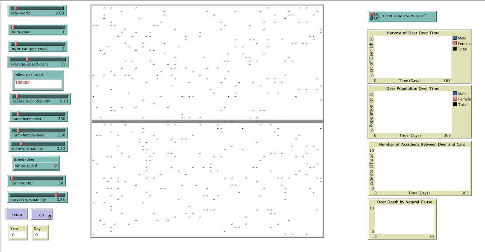

## Low number of hunters & low harvest probability
The following are the initial parameters:

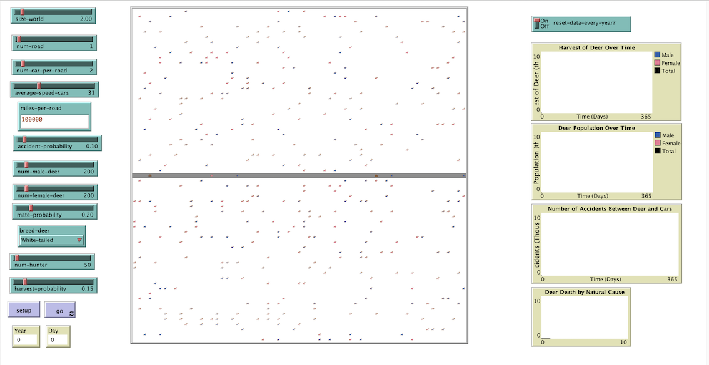

## Visual representation of the data collected:
### Effect on deer population:
The following graphs illustrate the data collected from multiple runs (each color represents a different run):

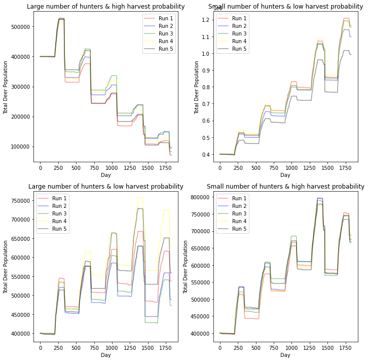

### Effect on deer involved in vehicular accidents:
The following graphs illustrate the data collected from multiple runs (each color represents a different run):

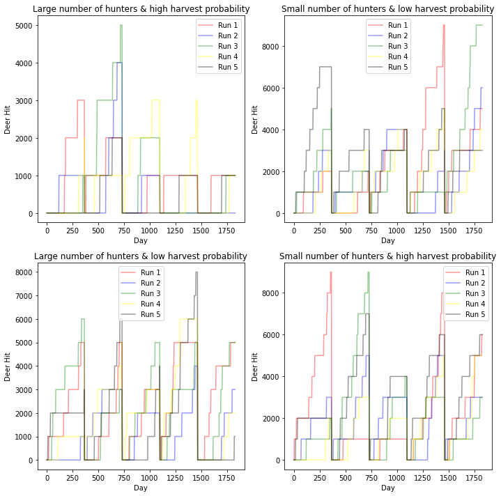

### Effect on number of deer harvested:
The following graphs illustrate the data collected from multiple runs (each color represents a different run):

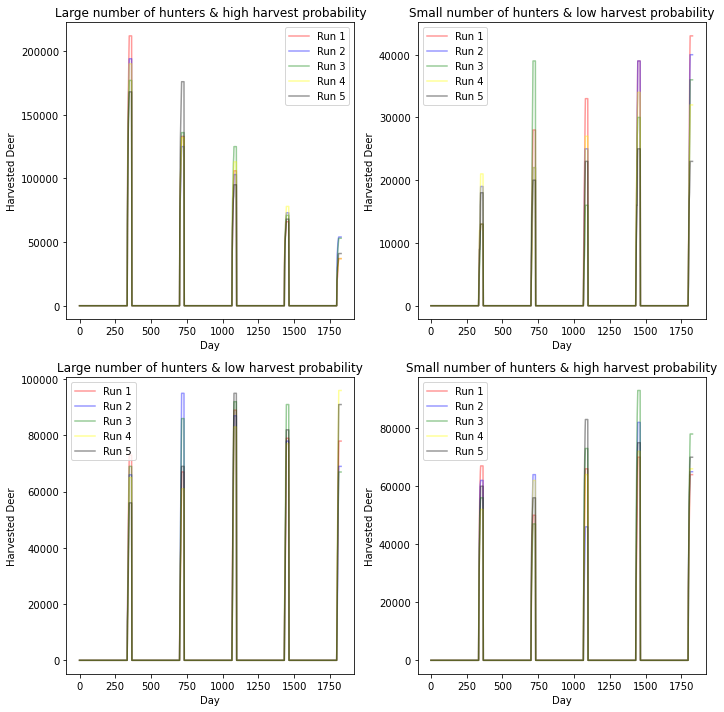

# 4. Verification and Validation of Model 
## Verification
A model verification is the process of determining whether an implemented model corresponds to the target conceptual model. This can be evaluated through sensitivity analysis and robustness. Based on the data collected from section 3, "Execution and Analysis of Model", the sensitivity of a change of parameter values can be effectively evaluated. 

It was clear that changing the number of hunters and their harvest probability rate affected the number of deer harvested, the number of deer involved in car accidents, and thereby, the overall deer population. As the number of hunters increased, the population of the deer decreased, leading to a decrease in car accidents involving deer; and obviously an increase in the number of deer harvested by hunters. The opposite happened when decreasing the number of hunters. Altering the harvest probability rate alone would have similar effects, but not as extreme. Interestingly enough, with a large number of hunters and a low probability of harvest (more realistic) the population stabilizes. This shows that the model is sensitive to the parameters but not in an extreme way. In addition, each run provided very similar results, implying that there isn't too much randomness.

## Validation
A model validation is the process of determining whether the implemented model corresponds to, and explains, some phenomenon in the real world. There are two levels at which the validation process is occuring: microvalidation and macrovalidation

Microvalidation is making sure the behaviours and mechanisms encoded into the agents in the model match up with their real-world analogs. It is hard to capture behaviours of deer, hunters, and cars in a model. For example, in my model, the deer and hunters perform a random walk. In reality it is much more complex than that. Deer and hunters might move based on many factors such as noise, areas that might be considered hot-spots for deer, where other deer might be situated, etc. 

Macrovalidation is the process of ensuring that the aggregate, emergent properties of the model correspond to aggregate properties in the real world. The fundamental idea is that as you increase the number of predators (in this case hunters and cars) the number of prey starts declining. This is true in the present model. The complexity of how it affects the population has been examined above in "3. Execution and Analysis of Model" and will be further examined when using real data from Pennsylvania, below.

As it is difficult to evaluate the microvalidation of the model, I will be focusing on the macrovalidation of the model and specifically perform empirical validation with Pennsylvania data to effectively validate the model.

## Using data from Pennsylvania
### Data gathered:
The following data was gathered from the Pennsylvania Game Commission, "Pennsylvania 2020-21 Deer Harvest Estimates" [2]:

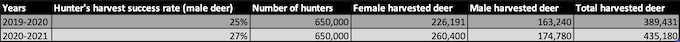

The following data was gathered from PennState College of Agricultral Sciences [3] and WildLife Informer [4]:

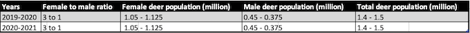

The following data was gathered from Wikipedia page called "Pennsylvania" [5] and Pennsylvania Department of Transportation [6,7] :

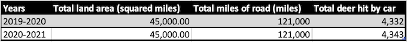

According to the Pennsylvania Game Commision, the hunting season for 2019-2020 was November 30th to December 14th, and for 2020-2021 was November 28th to December 12th [8,9]. 

Finally, according to  Pennsylvania Game Commision, the typical mating season for deer in Pennsylvania is December to February [10] 

### For 2019-2020:
#### Inserting models known parameters using Pennsylvania data:

* SIZE-WORLD: 5 (45000 square miles)
* NUM-ROAD: 1
* MILES-PER-ROAD: 121000 (miles)
* NUM-MALE-DEER: 375 (375,000 male deer)
* NUM-FEMALE-DEER: 1125 (1,125,000 female deer)
* BREED-DEER: White-tail
* NUM-HUNTER: 633 (633,000 hunters) 
* HARVEST-PROBABILITY: 0.25 (25%)

#### Inserting models unknown parameters:
The decision of what the other parameters should be is based on what would make sense and also what fits the best:

* NUM-CAR-PER-ROAD: 2 
* AVERAGE-SPEED-CAR: 31 (miles per hour)
* ACCIDENT-PROBABILITY: 0.10 (10%)
* MATE-PROBABILITY: 0.20 (20%)

### For 2020-2021:
#### Inserting models parameters:
Note that the inputted deer population parameter is from the results of the end of the 2019-2020 simulation:

* SIZE-WORLD: 5 (45000 square miles)
* NUM-ROAD: 1
* NUM-CAR-PER-ROAD: 2 
* AVERAGE-SPEED-CAR: 31 (miles per hour)
* ACCIDENT-PROBABILITY: 0.10 (10%)
* MILES-PER-ROAD: 121000 (miles)
* NUM-MALE-DEER: 478 (478,000 male deer)
* NUM-FEMALE-DEER: 1071 (1,071,000 female deer)
* MATE-PROBABILITY: 0.20 (20%) 
* BREED-DEER: White-tail
* NUM-HUNTER: 633 (633,000 hunters) 
* HARVEST-PROBABILITY: 0.27 27(%)

#### Results from simulation of the model:
5 runs of the simulation were performed to account for randomness. To see the results from the individual runs, check out their csv file and the analysis on the python notebook file.

The following is a table of the results:

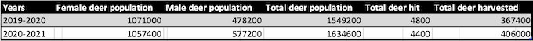

The following graph compares deer population growth simulated for 2019-2020 and 2020-2021:

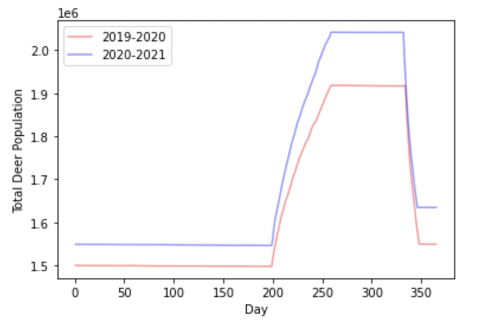

The following compares the simulated number of deer involved in vehicular accidents in 2019-2020 and 2020-2021 and the true number gathered from Pennsylvania data:

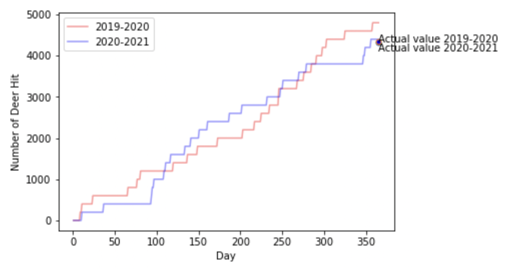

The following compares the simulated number of harvested deer in 2019-2020 and 2020-2021 and the true number from Pennsylvania data:

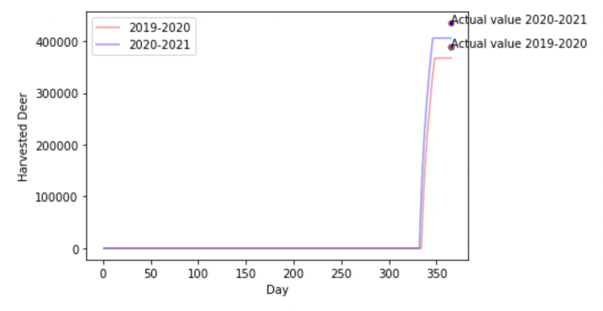

As can be seen above, the simulation has fairly well predicted the true values. This indicates that the simulation could be applied to other states or even countries. It could valuable insights on how different parameters and their values, affect deer population, number of harvested deer, and the number of deer involved in vehicular accidents. 

They're, of course, limitations to this model, as with any model: over simplification of reality. It doesn't consider different hunting season for antlered and antlerness deer, the effect of terrain and season on the deer, hunters, and even cars, the complexity of the road layout in a large environment, etc.

All in all, using the Pennsylvania data collected through a number of sources, has provided validation to the model/simulation and its accuracy in simulating deer population, number of deer involved in vehicular accident, and deer harvested.

# REFERENCES

1. Van Buskirk, A. (2020). ESTIMATING THE EFFECTS OF CHANGES IN HARVEST MANAGEMENT ON WHITE-TAILED DEER (ODOCOILEOUS VIRGINIANUS) POPULATIONS. [Pdf] Available at: https://etda.libraries.psu.edu/files/final_submissions/21979 (Accessed 1 Mar. 2023).
2. (2023) Pgc.pa.gov. Available at: https://www.pgc.pa.gov/Wildlife/WildlifeSpecies/White-tailedDeer/Documents/2021%20Harvest%20Estimates%20Report%2020210329.pdf (Accessed: 15 March 2023).
3. Dreams (2022). Available at: https://www.deer.psu.edu/dreams/ (Accessed: 15 March 2023).
4. Wildlife Informer (2022) Deer population by state (estimates and info), Wildlife Informer. Available at: https://wildlifeinformer.com/deer-population-by-state/ (Accessed: March 15, 2023). 
5. "Pennsylvania - Wikipedia". En.Wikipedia.Org, 2023, https://en.wikipedia.org/wiki/Pennsylvania. (Accessed 15 Mar 2023).
6. (2023) Dot.state.pa.us. Available at: https://www.dot.state.pa.us/public/PubsForms/Publications/PUB%20410.pdf (Accessed: 15 March 2023).
7. Crash Facts & Statistics (2023). Available at: https://www.penndot.pa.gov/TravelInPA/Safety/Pages/Crash-Facts-and-Statistics.aspx (Accessed: 15 March 2023).
8. Game Commission Details (2019). Available at: https://www.media.pa.gov/Pages/Game-Commission-Details.aspx?newsid=301#:~:text=The%20Board%20of%20Game%20Commissioners,in%2020%20Wildlife%20Management%20Units. (Accessed: 15 March 2023).
9. Game Commission Details (2020). Available at: https://www.media.pa.gov/Pages/Game-Commission-Details.aspx?newsid=381 (Accessed: 15 March 2023).
10. When is the rut? (2023). Available at: https://www.pgc.pa.gov/Wildlife/WildlifeSpecies/White-tailedDeer/Pages/Whenistherut.aspx (Accessed: 15 March 2023).

